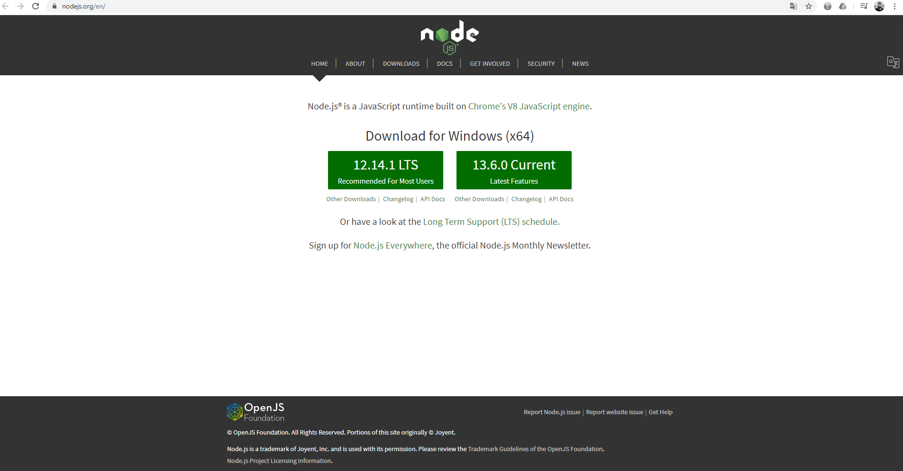
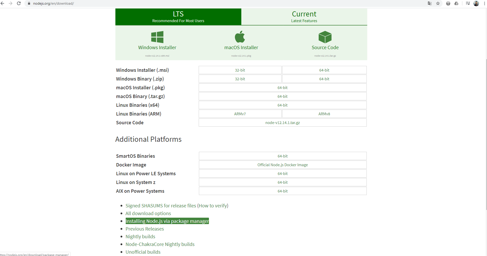
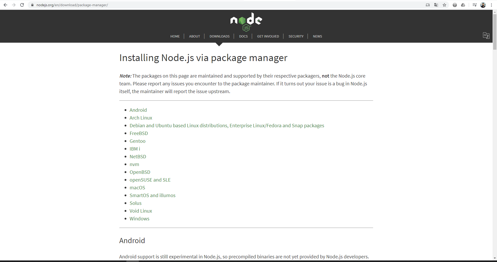
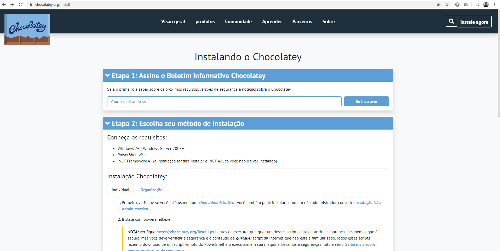

# semana-omniStack-10
 semana ommniStack-10  #rocketseat

 Projeto criado na Semana Omnistack 10 pelo pessoal da rocketseat 
 
 [Site da Rocketseat](https://rocketseat.com.br/)
 [Canal do Youtube Rocketseat](https://www.youtube.com/channel/UCSfwM5u0Kce6Cce8_S72olg)


## CONFIGURAÇÃO DO AMBIENTE E SOFTWARES NECESSÁRIOS (No Windowns)! 

**1 . Instalação do Node JS.**

[Site NodeJS](https://nodejs.org/en/)


Recomenda-se que se instala a versão LTS que é a de suporte a longo prazo. 




> É recomendado que se instale o node atraves dos gerenciadores de pacote pois assim facilita a ataulização mudanças e versão e etc!

Para conseguirmos instalar por gerenciador de pacotes iremos clicar em Dowloads e no canto inferior clicar em **Installing Node.js via Package Manager**



[Intalling package manager](https://nodejs.org/en/download/package-manager/)





Primeiro devemos instalar o Chocolato no caso do Windowns que é um gerenciador de pacotes via powershell:

[Download choco](https://chocolatey.org/install)



Após instalar o gerenciador de pacores volta no site do Node e executa o comando via terminal de instalação


E ai ele sera intalado no powerShell


>lembrando que para instalar a versão LTS voce deve executar no Powerselll o seguinte comando:

``` choco install nodejs-lts  ```

**Caso voce tenha instalado sem querer a versao current pode remover ela com o seguinte comando antes de instalar a versao lts** 

``` choco unistall nodejs -y --remove-dependencies   ```
