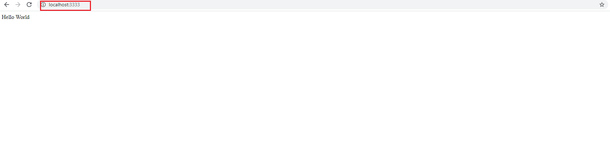

## Back-end

O que é o back-end da aplicação: 

O back-end é aquela parte do código que o usuário não enxerga é onde ficam:

- Regras de Negócios;
- Conexão Banco de Dados;
- Envio de e-mail;
- Comunicação com webservices;
- Autenticação do usuário;
- Criptografia e segurança; 


A **API Restfull** quer dizer que ela segue uns padrões, são padrões de metodos, tipos de parametros e etc. 

Quando se tem o backend feito com node precisamos de algo para interpretar com o fontend, 


E é usado o JSON que é a linguagem (ela nao e bem uma linguagem ela e uma estrutura de dados) que faz essa ponte entre o back e o front
a notação dele é JavaScriot Of Notation. 

Dentro da pasta do Backend através do powershell voce executa o sequinte comando:

``` yarn init -y  ```

para ele nao realizar perguntas sobre o projeto que nao sao importantes no momento


assim que realizarmos isso, ira aparecer um package.json 


apos isso devemos adicionar o express com o seguinte comando:

``` yarn add express ```

apos isso ira criar uma pasta chamada node_modules (sao todos os codigos dos pacotes instalados) e um arquivo chamado yarn.lock (ele guarda as informacoes dos pacotes instalados etc)

porque vai muito mais que apenas o express ou seja quando fazemos uma instalacao de um pacote esse processo e recursivo ou seja sempre um pacote depende de outro que depende de outro.

inciando o desenvolvimento:

<hr>

1 . Devemos criar um arquivo chamado Index.js

toda aplicacao ela tem rotas;  

ou seja exemplo de sintaxe:  Supondo o site www.semanaomnistack.com

supondo que eu quero acessar uma listagem de usuarios usaremos a rota www.semanaomnistack.com/user ou seja o **/user** e a rota que iremos ir

ou seja a rota e o endereco adicional que recebemos apos o endereco principal da aplicacao. 

<hr>

2 . Chamando o express e imputando ele na aplicacao:

```javascript

const express = require('express'); //chamando o express em uma variavel

const app = express(); //express ele e uma funcao


/***
 *  a aplicacao quando esta em ambiente de desenvolvimento sempre acesso a local host, ou seja sempre podemos escolher a posta que queremos rodar ela
 * 
 */


```


<hr>

3. Depois iremos definir o caminho onde essa aplicacao ira seguir:


```javascript

 app.get('/', (request, response) => {


 }); //aqui vai definir a rota e podemos imputar uma arrow function 

/**
 * Essa funcao acima recebe dois parametros que sao imbutidos de uma forma totalmente automatica pelo express
 * 
 * esses dois paramentros sao sempre fixos que sao: 
 * 
 * req  ---- que irei nomear como request (que representa a requisicao)
 * 
 * res ------ que irei nomear como response (que representa a resposta)
 * 
 * Explicando a sitaxe acima: 
 * 
 * O que sao esses dois parametros, quando eu acesso uma rota estou fazendo uma requisicao e ela pode conter informacoes, e o response e como iremos retornar uma resposta para meu 
 * cliente
 * 
 */


```


e para que se retorne uma resposta para testar a aplicacao usamos o send como abaixo

```javascript


 app.get('/', (request, response) => {
     return response.send('Hello World'); //response serve para mandar um texto ou seja to mandando retornar uma resposta

 });


```

**PARA EXECUTAR O ARQUIVO DEVE COLOCAR NA LINHA DE COMANDO DO TERMINAL**

``` node index.js ```  Ou seja estara mandando o node executar o arquivo index.js


Se observarmos ele ficara executando, porem para acessarmos temos que ir no navegador e colocar localhost e a porta selecionada que no caso do codigo foi a porta 3333




caso queria parar a execucao do node e so apertar ``` ctrl + c ```

<hr>

4. Utilizando a Estrutura de dados chamada Json \

No lugar de send como mostrado no codigo acima iremos colocar json e nao podemos enviar uam string nele, temos que enviar um vetor ou um objeto. para enviar um objeto coloca entre chafes


```Javascript


 app.get('/', (request, response) => {
     return response.json({ message: ' Hello World'}); 

 });

```

<hr>

5. Atualizacao automatica 

Uma coisa que temos que perceber se eu mudar qualquer coisa e salvar e tentar atualizar ele nao ira mudar, porque o node depois que ele executou ele nao fica observando as alteracoes no codigo simplemsente ele so fica no anterior, para isso agente vai instalar uma outra dependencia / biblioteca com o seguinte comnado:

``` yarn add nodemon -D ``` esse -D ele significa que e uma dependencia de desenvolvimento

dependencias de desenvolvimento ficam separadas no packege.json dentro de devDependencies, o que quer dizer uma dependencia de desenvolvimento? sao dependencias que nos nao iremos utilizar ela quando a aplicacao for para producao que iremos usar somente no ambiente de desenvolvimento. 

<hr>

6. Executando a aplicacao em ambiente de desenvolvimento:

podemos usar:

``` yarn nodemon index.js ``` 


Executando asssim ou seja sempre que alterarmos algo no codigo sera atualizado automaticamente


**POREM PARA NAO FICARMOS ESCREVENDO TODA VEZ YARN NODEMON (NOME DO ARQUIVO) PODEMOS CRIAR UM MINI SCRIPT NO PACKGE.JSON** 

como abaixo:


```json

{
  "name": "backend",
  "version": "1.0.0",
  "main": "index.js",
  "license": "MIT",
  "scripts": {
    "dev" : "nodemon index.js"
  },
  "dependencies": {
    "express": "^4.17.1",
    "nodemon": "^2.0.2"
  }
}


```

ou seja estou falando no script acima que toda vez que eu escrever **yarn dev** ira executar a instrucao dentro do terminal via script como **nodemon index.js**


6. Apos deixar executando abriremos um outro terminal onde esta apontado com a seta na imagagem abaixo e logo em seguida como fica aberto dois terminais.


Ficara assim!


Isso para fazer instalacoes de outras dependencias executar ou aglo assim.


<hr>

## Entendendo as rotas e Metodos

Os principais metodos que utilizaremos sao: 

| Metodos |  Descricao                                                                                                                        |
|---------|-----------------------------------------------------------------------------------------------------------------------------------|
|  get    | Quando se cria uma rota usando o metodo get, quer dizer que estou buscando uma informacao ou seja get do ingles significa pegar   | 
|  post   |                                                                                                                                   |
|  put    | Quando se quer editar um recurso da aplicacao                                                                                     |  
|  delete | E o delete e para deletar                                                                                                         |


get conseguimos acessar sem precisar de outros sistemas porque ele ja e nativo do browser, porem se quisermos testar os outros metodos 