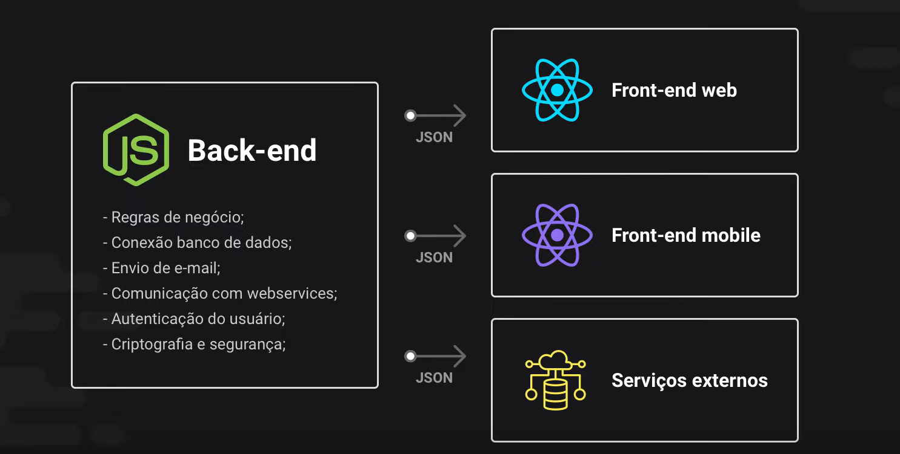
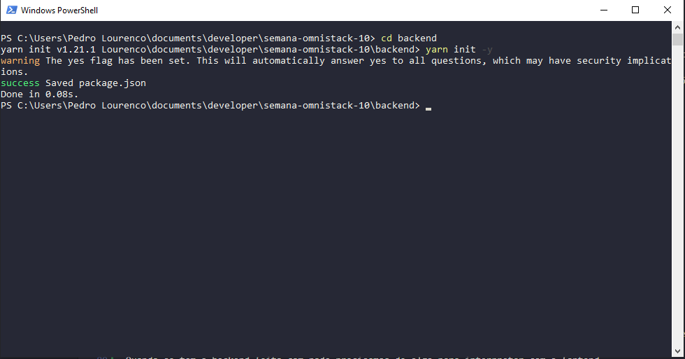

## Back-end

O que é o back-end da aplicação: 

O back-end é aquela parte do código que o usuário não enxerga é onde ficam:

- Regras de Negócios;
- Conexão Banco de Dados;
- Envio de e-mail;
- Comunicação com webservices;
- Autenticação do usuário;
- Criptografia e segurança; 


A **API Restfull** quer dizer que ela segue uns padrões, são padrões de metodos, tipos de parametros e etc. 

Quando se tem o backend feito com node precisamos de algo para interpretar com o fontend, 



E é usado o JSON que é a linguagem (ela nao e bem uma linguagem ela e uma estrutura de dados) que faz essa ponte entre o back e o front
a notação dele é JavaScriot Of Notation. 

Dentro da pasta do Backend através do powershell voce executa o sequinte comando:

``` yarn init -y  ```

para ele nao realizar perguntas sobre o projeto que nao sao importantes no momento




assim que realizarmos isso, ira aparecer um package.json 


apos isso devemos adicionar o express com o seguinte comando:

``` yarn add express ```

apos isso ira criar uma pasta chamada node_modules (sao todos os codigos dos pacotes instalados) e um arquivo chamado yarn.lock (ele guarda as informacoes dos pacotes instalados etc)

porque vai muito mais que apenas o express ou seja quando fazemos uma instalacao de um pacote esse processo e recursivo ou seja sempre um pacote depende de outro que depende de outro.

inciando o desenvolvimento:

<hr>

1 . Devemos criar um arquivo chamado Index.js

toda aplicacao ela tem rotas;  

ou seja exemplo de sintaxe:  Supondo o site www.semanaomnistack.com

supondo que eu quero acessar uma listagem de usuarios usaremos a rota www.semanaomnistack.com/user ou seja o **/user** e a rota que iremos ir

ou seja a rota e o endereco adicional que recebemos apos o endereco principal da aplicacao. 

<hr>

2 . Chamando o express e imputando ele na aplicacao:

```javascript

const express = require('express'); //chamando o express em uma variavel

const app = express(); //express ele e uma funcao


/***
 *  a aplicacao quando esta em ambiente de desenvolvimento sempre acesso a local host, ou seja sempre podemos escolher a posta que queremos rodar ela
 * 
 */


```


<hr>

3. Depois iremos definir o caminho onde essa aplicacao ira seguir:


```javascript

 app.get('/', (request, response) => {


 }); //aqui vai definir a rota e podemos imputar uma arrow function 

/**
 * Essa funcao acima recebe dois parametros que sao imbutidos de uma forma totalmente automatica pelo express
 * 
 * esses dois paramentros sao sempre fixos que sao: 
 * 
 * req  ---- que irei nomear como request (que representa a requisicao)
 * 
 * res ------ que irei nomear como response (que representa a resposta)
 * 
 * Explicando a sitaxe acima: 
 * 
 * O que sao esses dois parametros, quando eu acesso uma rota estou fazendo uma requisicao e ela pode conter informacoes, e o response e como iremos retornar uma resposta para meu 
 * cliente
 * 
 */


```